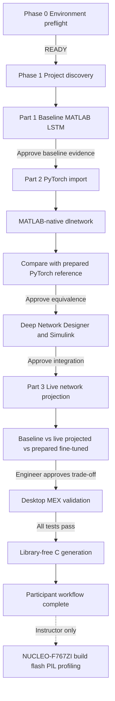
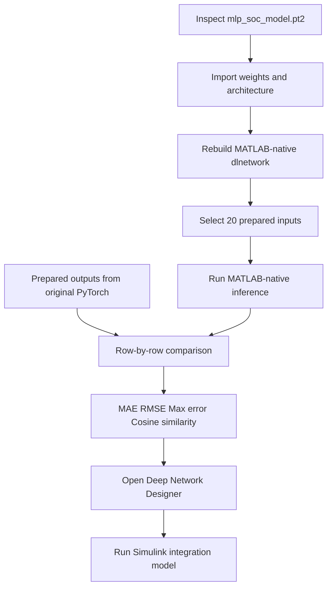
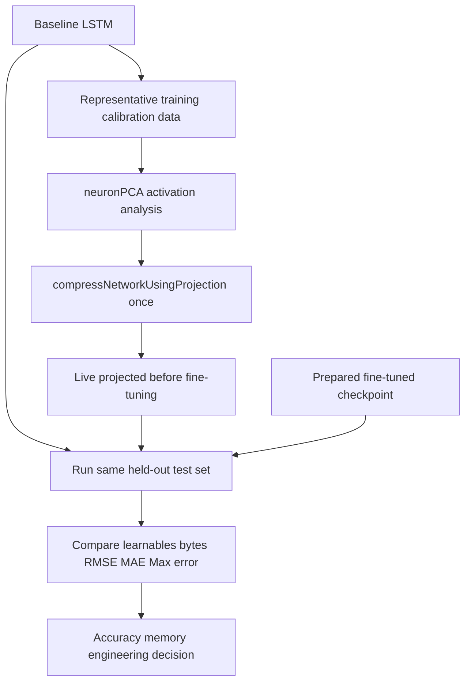

# คู่มืออธิบาย Workflow Agentic AI Embedded แบบละเอียด

เอกสารนี้ช่วยให้ผู้เข้าร่วมเข้าใจว่า Prompt แต่ละช่วงสั่งให้ AI Agent ทำอะไรกับข้อมูลและโมเดล เหตุใดจึงต้องทำขั้นตอนนั้น ผลลัพธ์ใดควรตรวจสอบ และเหตุใด Agent ต้องหยุดรอการอนุมัติก่อนทำงานขั้นถัดไป

กิจกรรมนี้ไม่ได้ให้ Agent ทำงานแทน Engineer โดยไม่ตรวจสอบ แต่ใช้ Agent เป็นผู้สร้าง Script รัน Workflow และรวบรวมหลักฐาน ส่วนผู้เข้าร่วมทำหน้าที่ตรวจสมมติฐาน ตรวจผล และตัดสินใจที่ Approval gate ทุกช่วง

Prompt สำหรับคัดลอกอยู่ใน [`WORKSHOP_PROMPTS.md`](WORKSHOP_PROMPTS.md) ส่วนเอกสารนี้ใช้สำหรับอ่านทำความเข้าใจและใช้เป็น Script ประกอบการอธิบายของผู้สอน

## ผลลัพธ์ที่ต้องเข้าใจก่อนเริ่ม

เมื่อจบกิจกรรม ผู้เข้าร่วมควรอธิบายได้ว่า

1. Baseline model มีความแม่นยำเท่าใดก่อนเปลี่ยนแปลงโมเดล
2. การนำเข้าโมเดล PyTorch แตกต่างจากการพิสูจน์ว่าโมเดล MATLAB ให้ผลเท่ากันอย่างไร
3. Deep Network Designer ใช้ตรวจโครงสร้าง ไม่ได้เป็นเครื่องมือสร้าง Reference output
4. Simulink ใช้ตรวจ System integration และรูปแบบสัญญาณก่อนสร้างโค้ด
5. Network projection ลดจำนวน Learnables ได้อย่างไร และเหตุใด Accuracy อาจลดลง
6. Fine-tuning ช่วยกู้ Accuracy ได้อย่างไร
7. MEX ใช้ตรวจ Generated implementation บนเครื่องก่อนสร้าง C code สำหรับ Target
8. PIL ใช้ยืนยันว่าโค้ดที่รันบน Cortex-M7 ให้ผลสอดคล้องกับ MATLAB และ Simulink

## ภาพรวม Workflow



ถ้า GitHub หรือ Markdown viewer ไม่แสดง Mermaid ให้ตีความ Flow เป็นลำดับดังนี้

```text
ตรวจ Environment
  -> สำรวจ Project
  -> ประเมิน Baseline LSTM
  -> Import PyTorch และสร้าง MATLAB-native dlnetwork
  -> เทียบกับ PyTorch reference
  -> ตรวจ Deep Network Designer และ Simulink
  -> Agent ทำ Projection จริงหนึ่งครั้ง
  -> เทียบ Baseline, Live projected และ Prepared fine-tuned
  -> ตรวจ MEX
  -> สร้างและตรวจ C code
  -> ผู้สอนสาธิต Hardware และ PIL
```

## ข้อมูลและโมเดลที่ใช้

| รายการ | หน้าที่ | Agent เปลี่ยนไฟล์ต้นฉบับหรือไม่ |
|---|---|---|
| `LGHG2@n10C_to_25degC` | ชุดข้อมูลแบตเตอรี่ที่แบ่ง Train Validation และ Test ไว้แล้ว | ไม่เปลี่ยนและไม่แบ่งข้อมูลใหม่ |
| `trainedNetwork.mat` | Baseline MATLAB-native LSTM | โหลดเพื่อประเมิน ไม่เขียนทับ |
| `mlp_soc_model.pt2` | โมเดล MLP จาก PyTorch สำหรับเรียนรู้ Import workflow | โหลดโครงสร้างและ Weight ไม่เขียนทับ |
| `part2_pytorch_reference_outputs.csv` | Output ที่รันจาก Original PyTorch model ไว้ล่วงหน้า | อ่านเป็น Ground truth ไม่สร้างจาก MATLAB model |
| `dlnetFineTuned.mat` | Projected LSTM ที่ Fine-tune ไว้ก่อนงาน | โหลดเพื่อเปรียบเทียบ ไม่เขียนทับ |
| `agentic_ai/generated` | Script ที่ Agent สร้างให้ผู้เข้าร่วมตรวจ | Agent เขียนได้ |
| `agentic_ai/results` | ตาราง Metrics กราฟ MAT และ CSV ที่เป็นหลักฐาน | Agent เขียนได้ |
| `agentic_ai/build` | MEX C code และ Build report | Code generator เขียนได้ |

กฎสำคัญคือทุกโมเดลที่นำมาเปรียบเทียบต้องใช้ Input, ลำดับ Sample, จำนวน Sample และชนิดข้อมูลเดียวกัน มิฉะนั้นค่า RMSE หรือ MAE จะไม่ใช่การเปรียบเทียบที่ยุติธรรม

## Phase 0 Environment preflight

### Prompt นี้ต้องการพิสูจน์อะไร

ก่อนเปิดข้อมูลหรือโหลดโมเดล Agent ต้องตรวจว่า Environment พร้อมจริง ได้แก่ MATLAB R2026a, Toolbox, Support package, MATLAB MCP connection, Simulink Agentic Toolkit, Embedded AI skill, Compiler และสิทธิ์เขียนโฟลเดอร์ผลลัพธ์

### สิ่งที่ Agent ทำจริง

1. ตรวจว่า Agent มองเห็น skill `embedded-ai-deployment` หรือ skill ทางการ `matlab-deploy-embedded-ai`
2. ตรวจว่าเชื่อมกับ MATLAB session ผ่าน MCP ได้
3. รัน `agentic_ai/scripts/workshopPreflight.m`
4. ตรวจ MATLAB release และผลิตภัณฑ์ที่จำเป็น
5. ตรวจ Compiler แยกจาก Requirement อื่น เพราะผู้เข้าร่วมยังสามารถเรียนส่วน AI ได้แม้ยัง Compile MEX ไม่ได้
6. ตรวจว่า `agentic_ai/generated` และ `agentic_ai/results` เขียนไฟล์ได้
7. รายงาน `READY`, `READY WITH FALLBACK` หรือ `NOT READY`

### สิ่งที่ยังไม่เกิดขึ้น

- ยังไม่เปิด Dataset
- ยังไม่โหลด AI model
- ยังไม่ Train หรือ Compress
- ยังไม่สร้าง C code

### วิธีอ่านผล

- `READY` หมายถึงทำ Participant workflow ได้ครบในเครื่องนั้น
- `READY WITH FALLBACK` หมายถึงส่วน AI ทำได้ แต่ MEX อาจต้องใช้หลักฐานที่ผู้สอนเตรียมไว้
- `NOT READY` หมายถึงต้องแก้ Requirement ที่ระบุก่อนเริ่ม

### ประโยคที่ผู้สอนใช้พูด

> ขั้นตอนนี้เหมือน Pre-flight check ของเครื่องบิน เราตรวจระบบก่อนแตะข้อมูลและโมเดล เพื่อแยกปัญหาการติดตั้งออกจากปัญหาของ AI workflow

## Phase 1 Project discovery

### Prompt นี้ทำอะไร

Prompt บอก Agent ให้สำรวจโครงสร้าง Repository เท่านั้น และย้ำ Guardrail ว่าห้ามแก้ `Exercise_1.m`, `Exercise_2.m` และ `Exercise_3.m` Agent ต้องสร้าง Script ใหม่ใน `agentic_ai/generated` และเก็บหลักฐานใน `agentic_ai/results`

### สิ่งที่ Agent ควรรายงาน

- Dataset อยู่ที่ใดและแบ่ง Train Validation Test อย่างไร
- โมเดลใดเป็น Baseline
- โมเดลใดมาจาก PyTorch
- โมเดลใดเป็น Prepared fine-tuned checkpoint
- Simulink model ใดเกี่ยวข้อง
- Workflow นี้เลือก Embedded AI Pattern 1 เพราะ Target เป็น Cortex-M7 และต้องใช้ MATLAB-native `dlnetwork` สำหรับ Compression และ Code Generation

### เหตุใดต้องหยุดหลัง Discovery

Engineer ต้องยืนยันก่อนว่า Agent เข้าใจ Project ถูกต้อง หากเลือกโมเดลหรือ Dataset ผิด ทุกผลลัพธ์หลังจากนั้นจะผิดแม้ Script จะรันสำเร็จ

### ประโยคที่ผู้สอนใช้พูด

> Agent ไม่ควรเริ่มแก้หรือรัน Project ทันที เราให้มันสร้างแผนที่ของ Project ก่อน แล้วมนุษย์ตรวจว่ามันเลือกข้อมูล โมเดล และ Target ถูกชุด

## Part 1 Baseline MATLAB LSTM

### จุดประสงค์

Part 1 สร้างค่ามาตรฐานก่อน Compression และ Code Generation ถ้าไม่มี Baseline เราจะไม่ทราบว่าการลดขนาดโมเดลทำให้ Accuracy เปลี่ยนไปเท่าใด

### Data ที่ใช้

- ใช้ Test split ที่เตรียมไว้แล้ว
- Test data ครอบคลุมอุณหภูมิ `-10`, `0`, `10` และ `25` องศาเซลเซียส
- Input เป็น Sequence ของสัญญาณแบตเตอรี่ที่เตรียมไว้
- Target คือค่า State of Charge จริง
- ไม่ใช้ Test data สำหรับ Train
- ไม่สร้าง Data split ใหม่

### Model ที่ใช้

Agent โหลด `Part_1_AI_modeling/models/trainedNetwork.mat` ซึ่งเป็น MATLAB-native LSTM ที่ Train ไว้แล้ว ใน Workshop หนึ่งชั่วโมง Agent ไม่ Train โมเดลใหม่

### สิ่งที่ Agent ทำจริงตาม Prompt


1. สร้าง Script ที่มองเห็นได้ใน `agentic_ai/generated`
2. โหลด Baseline LSTM
3. เลือก Representative held-out test data ตามที่ Prompt กำหนด
4. รัน `predict` หรือ Workflow inference ที่รองรับ `dlnetwork`
5. เปรียบเทียบ Predicted SoC กับ True SoC ตาม Sample เดียวกัน
6. คำนวณ Metric จากผลที่รันจริง ไม่ใช้ตัวเลขที่พิมพ์ค้างไว้ใน Script
7. บันทึก Plot ตาราง และ Test count
8. หยุดรออนุมัติ

### Output ที่ผู้เข้าร่วมต้องดู

- จำนวน Test samples
- RMSE ของ Baseline
- กราฟ True SoC เทียบ Predicted SoC
- ตำแหน่งไฟล์ Evidence

RMSE ยิ่งต่ำหมายถึงค่าทำนายโดยรวมใกล้ค่าจริงมากขึ้น แต่ห้ามนำ RMSE จากคนละ Test set มาเทียบกัน ตัวอย่างเช่น ค่า Baseline จาก Full independent sequences และค่าจาก Deployment windows อาจต่างกันโดยที่โมเดลไม่ได้เปลี่ยน

### Approval gate

ผู้เข้าร่วมอนุมัติเมื่อ

- Agent ใช้ Test data ไม่ใช่ Training data
- จำนวน Sample ถูกต้อง
- กราฟไม่มีการเลื่อนลำดับเวลา
- Metric คำนวณจากผลในรอบปัจจุบัน

### ประโยคที่ผู้สอนใช้พูด

> เรากำลังสร้างไม้บรรทัดของระบบ ก่อนลดขนาดโมเดลเราต้องรู้ก่อนว่าโมเดลเดิมแม่นยำเท่าใดบนข้อมูลที่ไม่ใช้ Train

## Part 2 PyTorch import และ Numerical equivalence

### สิ่งที่มักทำให้ผู้เข้าร่วมสับสน

การ Import `.pt2` เข้า MATLAB ไม่ได้หมายความว่า MATLAB ตรวจแล้วว่า Output ถูกต้อง การ Import มีหน้าที่นำ Architecture และ Weight มาเป็น MATLAB representation ส่วน Equivalence test เป็นอีกขั้นตอนหนึ่งที่ต้องรัน Input เดียวกันผ่านโมเดลทั้งสองฝั่งแล้วเปรียบเทียบ Output

### Model และ Reference ที่ใช้

- `mlp_soc_model.pt2` เป็น Original PyTorch MLP
- MATLAB นำ Weight และโครงสร้างมาสร้าง MATLAB-native `dlnetwork`
- `part2_pytorch_reference_outputs.csv` เก็บ Output จาก Original PyTorch model ที่รันไว้ล่วงหน้า
- Reference CSV ไม่ใช่ Output จาก MATLAB imported model

เหตุผลที่ต้องใช้ Original PyTorch output เป็น Reference คือถ้าใช้ MATLAB model ตรวจตัวเอง Conversion error อาจเกิดขึ้นแต่ไม่ถูกตรวจพบ

### 200 reference cases กับ 20 workshop cases ต่างกันอย่างไร

Repository เตรียม Reference pool ไว้ 200 cases โดยมี 50 cases ต่ออุณหภูมิ การสาธิตสดหนึ่งชั่วโมงให้ Agent เสนอ 20 representative cases คือ 5 cases ที่กระจายจากแต่ละอุณหภูมิ แล้วหยุดรออนุมัติ ส่วนการตรวจครบ 200 cases เป็น Optional extended validation หรือ Instructor fallback

ดังนั้น

- 200 cases คือขอบเขต Reference ที่เตรียมไว้
- 20 cases คือชุดย่อยที่ผู้เข้าร่วมอนุมัติสำหรับ Live workshop
- ห้ามสลับลำดับ Row ระหว่าง Prepared input และ Reference CSV

### สิ่งที่ Agent ทำจริง



1. ตรวจ Input และ Output shape ของ PyTorch model
2. Import หรืออ่าน Weight ด้วย Workflow ของ MATLAB R2026a
3. สร้าง MATLAB-native `dlnetwork` ที่ใช้ Layer มาตรฐานและเหมาะกับ Cortex-M Pattern 1
4. เสนอ 20 cases และหยุดรอผู้เข้าร่วมตอบอนุมัติ
5. รัน MATLAB-native model บน Input 20 cases
6. อ่าน PyTorch reference จาก CSV ใน Row เดียวกัน
7. คำนวณ MAE, RMSE, Maximum absolute error และ Cosine similarity
8. เปิด Native network ใน Deep Network Designer
9. รัน Existing Simulink integration model
10. บันทึกหลักฐานและหยุด

### Deep Network Designer ใช้ทำอะไร

Deep Network Designer เป็น Visual review gate ใช้ดู Layer, Connection, Input size, Output size และ Learnable parameters ช่วยให้ผู้เข้าร่วมเห็นว่าโมเดล PyTorch ถูกแปลงเป็น MATLAB-native network แบบใด

Deep Network Designer ไม่ได้สร้าง PyTorch reference และการเปิด App อย่างเดียวไม่ได้รัน Equivalence test การเปรียบเทียบเกิดใน Script ที่ Agent สร้าง โดยรัน Inference แล้วเปรียบเทียบ Array ทีละ Case

### Metric แต่ละตัวบอกอะไร

| Metric | ความหมาย |
|---|---|
| MAE | ค่าเฉลี่ยของขนาดความต่างระหว่าง MATLAB output และ PyTorch reference |
| RMSE | คล้าย MAE แต่ให้น้ำหนัก Error ขนาดใหญ่มากขึ้น |
| Maximum absolute error | ความต่างที่แย่ที่สุดในทุก Case ที่ทดสอบ |
| Cosine similarity | ตรวจว่ารูปแบบและทิศทางของ Output vector สอดคล้องกันหรือไม่ ค่าใกล้ 1 คือใกล้กันมาก |

Validated 20-case reference ของ Workshop เคยได้ MAE ประมาณ `6.26e-8`, RMSE `1.05e-7`, Maximum absolute error `2.38e-7` และ Cosine similarity `1.0` ความต่างหลักทศนิยมท้ายเล็กน้อยเกิดจาก Numerical precision ได้

### เหตุใด PyTorch MLP ไม่ใช่ Final embedded model

Part 2 มีไว้สาธิต Third-party import และ Equivalence workflow ส่วน Final deployment path ใช้ Projected LSTM ใน Part 3 เพราะโจทย์ Workshop ต้องการแสดง Model compression, MEX, C code และ Cortex-M7 deployment ต่อเนื่อง

### ประโยคที่ผู้สอนใช้พูด

> เราไม่ได้ถามเพียงว่า Import สำเร็จหรือไม่ แต่ถามว่า Input เดียวกันผ่าน Original PyTorch และ MATLAB-native model แล้วได้ Output ตรงกันหรือไม่ App ช่วยให้ดูโครงสร้าง ส่วน Script และ Reference CSV เป็นผู้พิสูจน์ตัวเลข

## Part 2 Simulink comparison

### จุดประสงค์ของ Simulink

MATLAB inference ตรวจ Algorithm เป็นหลัก แต่ Embedded system ต้องมี Signal dimension, Datatype, Sample time และลำดับการประมวลผลที่ถูกต้อง Simulink จึงใช้ตรวจ System-level integration ก่อน Code Generation

### สิ่งที่ Agent ทำ

1. ใช้ MATLAB-native model ที่ผ่าน Equivalence แล้ว
2. เตรียม Input เป็น `single` และใช้ Sample เดียวกับ MATLAB comparison
3. รัน MATLAB prediction
4. รัน Simulink Normal Simulation
5. เทียบ Output แบบ Sample ต่อ Sample
6. รายงาน Input size, Datatype, Sample time, RMSE และ Maximum absolute error

### ถ้า Direct PyTorch block รันไม่ได้

R2026a อาจพบ Size หรือ Datatype propagation issue ใน Direct PyTorch Predict หรือ S-function path Prompt กำหนดให้ Agent บันทึกเป็น Optional-path warning แล้วใช้ MATLAB-native Simulink model ต่อ ห้ามแก้ไฟล์ Exercise ต้นฉบับเพื่อบังคับให้ Optional path ผ่าน

### ประโยคที่ผู้สอนใช้พูด

> MATLAB บอกว่า Algorithm คำนวณถูก ส่วน Simulink บอกว่าเมื่อวาง Algorithm เข้าในระบบที่มีขนาดสัญญาณ ชนิดข้อมูล และเวลา Sample จริงแล้ว พฤติกรรมยังตรงกัน

## Part 3 Live projection และ Fine-tuning comparison

### เป้าหมายของ Part 3

ให้ผู้เข้าร่วมเห็น Agent ทำ Compression จริงหนึ่งครั้ง แล้วเห็นผลลัพธ์สามสถานะ

1. Baseline LSTM ก่อน Compression
2. Live projected candidate หลัง Projection แต่ก่อน Fine-tuning
3. Prepared projected and fine-tuned checkpoint ที่ Train ไว้ก่อนงาน

### เหตุใดใช้ Network projection

LSTM มี Weight matrix จำนวนมาก Projection ใช้ Activation จาก Representative data ทำ `neuronPCA` เพื่อค้นหาทิศทางสำคัญของข้อมูล แล้วลด Rank ของการคำนวณใน Layer ที่รองรับ ผลคือจำนวน Learnables และ Parameter bytes ลดลง

Projection ไม่ใช่การ Train Weight ใหม่ ดังนั้นโมเดลอาจเล็กลงทันทีแต่ Accuracy ลดลง เพราะ Representation capacity ถูกตัดออกบางส่วน

### Compression target 0.95 หมายถึงอะไร

`LearnablesReductionGoal=0.95` เป็นเป้าหมายให้ Algorithm พยายามลด Learnables ตามเงื่อนไขของ Network และ API ไม่ใช่คำรับประกันว่าไฟล์สุดท้ายจะเล็กลง 95 เปอร์เซ็นต์พอดี Agent ต้องรายงาน Actual learnables และ Actual reduction จากโมเดลที่สร้างจริง

### สิ่งที่ Agent ทำจริง



1. โหลด Baseline `trainedNetwork.mat`
2. ใช้ Representative training/calibration selection เดิมใน `Exercise_3.m`
3. คำนวณ `neuronPCA`
4. เรียก `compressNetworkUsingProjection` หนึ่งครั้งด้วย Target เดียว
5. บันทึก Live projected candidate แยกจากไฟล์ต้นฉบับ
6. รัน Inference ของ Baseline และ Live projected candidate บน Held-out test sequences ชุดเดียวกัน
7. โหลด `dlnetFineTuned.mat`
8. ตรวจ Architecture และ Learnable count ว่าสอดคล้องกับ Live candidate หรือไม่
9. รัน Prepared checkpoint บน Test data ชุดเดิม
10. สร้างตารางและกราฟ Accuracy-Memory trade-off
11. หยุดรอ Engineer อนุมัติก่อนสร้าง MEX

### สิ่งที่ไม่เกิดขึ้นใน Prompt 3A Lite

- ไม่ทำ Compression sweep หลายค่า
- ไม่เรียก `trainnet`
- ไม่ Fine-tune สดในห้อง
- ไม่แก้ `Exercise_3.m`
- ไม่เขียนทับ `dlnetFineTuned.mat`
- ยังไม่สร้าง MEX หรือ C code

### Prepared fine-tuned checkpoint คืออะไร

หลัง Projection โมเดลมักสูญเสีย Accuracy Fine-tuning คือการนำ Projected network ไป Train เพิ่มด้วย Learning rate ต่ำและ Validation data เพื่อปรับ Weight ที่เหลือให้เหมาะกับโครงสร้างใหม่

เนื่องจากการ Fine-tune สดอาจใช้เวลาต่างกันตามเครื่อง Workshop จึงโหลด Checkpoint ที่ Fine-tune ไว้ก่อนงาน เพื่อให้ผู้เข้าร่วมเห็นผลหลัง Fine-tuning โดยไม่เสียเวลารอ Train

คำว่า Before และ After fine-tuning ใช้ได้เมื่อ Live projected candidate กับ Prepared checkpoint มี Projected architecture และ Learnable count ที่เข้ากัน หากไม่ตรง Agent ต้องรายงานว่าเป็นคนละ Compressed candidates และห้ามสรุปว่า Accuracy ต่างกันเพราะ Fine-tuning เพียงอย่างเดียว

### ตารางที่ผู้เข้าร่วมควรเห็น

| Model | Learnables | Estimated parameter bytes | Actual reduction | RMSE | MAE | Max error | Delta from baseline |
|---|---:|---:|---:|---:|---:|---:|---:|
| Baseline LSTM | ค่าจากรอบปัจจุบัน | ค่าจากรอบปัจจุบัน | 0% | ค่าจากรอบปัจจุบัน | ค่าจากรอบปัจจุบัน | ค่าจากรอบปัจจุบัน | 0 |
| Live projected before fine-tuning | Agent รายงานสด | Agent รายงานสด | Agent คำนวณสด | Agent คำนวณสด | Agent คำนวณสด | Agent คำนวณสด | เทียบ Baseline |
| Prepared fine-tuned checkpoint | Agent ตรวจจากไฟล์ | Agent ตรวจจากไฟล์ | Agent คำนวณ | Agent รันใหม่ | Agent รันใหม่ | Agent รันใหม่ | เทียบ Baseline |

อย่าใช้ค่าที่เคยรันจากคนละ Test selection ใส่รวมในตารางนี้ ตัวเลขทุกแถวต้องมาจาก Input ชุดเดียวกันในรอบเดียวกัน

### วิธีอ่านกราฟ

- ถ้า Parameter bytes ลดลง แปลว่าโมเดลใช้พื้นที่เก็บ Weight น้อยลง
- ถ้า RMSE สูงขึ้น แปลว่า Accuracy แย่ลงเมื่อเทียบกับ Baseline
- ถ้า Prepared fine-tuned RMSE ต่ำกว่า Live projected RMSE แปลว่า Fine-tuning มีแนวโน้มช่วยกู้ Accuracy
- โมเดลที่ดีที่สุดไม่จำเป็นต้องเล็กที่สุด ต้องเลือกตาม Memory budget และ Accuracy requirement

### ประโยคที่ผู้สอนใช้พูด

> ตอนนี้ Agent Compress จริงและสร้างโมเดลใหม่ใน Session นี้ เราจึงเห็นผลก่อน Fine-tuning โดยตรง จากนั้นเราโหลด Checkpoint ที่ Fine-tune ไว้ก่อนงานเพื่อแสดงว่าการปรับ Weight เพิ่มสามารถกู้ Accuracy ได้เพียงใด การตัดสินใจเลือกโมเดลยังเป็นหน้าที่ของ Engineer

## Desktop MEX validation

### MEX คืออะไรใน Workflow นี้

MEX คือ Generated implementation ที่ Compile แล้วรันบน Host computer ใช้เป็นสะพานระหว่าง MATLAB Algorithm กับ Target C code ถ้า MATLAB กับ MEX ยังไม่ตรง การไป Debug บน Hardware จะยากขึ้น

### สิ่งที่ Agent ต้องทำ

1. ใช้โมเดลที่ Engineer อนุมัติจาก Part 3
2. สร้าง Code Generation entry-point function ที่รับ Input shape และ `single` datatype ชัดเจน
3. เสนอจำนวน Deterministic tests ก่อนรันและรออนุมัติ
4. Generate MEX
5. รัน Input เดียวกันผ่าน MATLAB model และ MEX
6. เปรียบเทียบ RMSE และ Maximum absolute error ภายใต้ Tolerance
7. บันทึก Detailed และ Summary evidence
8. ไป C generation ต่อเมื่อทุก Test ผ่าน

Validated instructor run เคยใช้ 32 windows และผ่าน 32 จาก 32 แต่ผู้เข้าร่วมต้องอ่านผลจากรอบปัจจุบัน ไม่ควรถือว่าค่าที่เคยผ่านรับประกันว่าเครื่องอื่นจะผ่านโดยอัตโนมัติ

### ประโยคที่ผู้สอนใช้พูด

> ก่อนนำโค้ดไป Hardware เราสร้างด่านตรวจบน Computer ถ้า Generated implementation ยังไม่ตรงกับ MATLAB เราหยุดแก้ที่นี่ เพราะวิเคราะห์ง่ายกว่าบนไมโครคอนโทรลเลอร์

## Library-free C generation

### จุดประสงค์

หลัง MEX ผ่าน Agent สร้าง Standalone C สำหรับ ARM Cortex-M โดยเลือก Configuration ที่ไม่พึ่ง External deep-learning runtime ตาม Workflow ที่ผ่านการตรวจสอบ

### สิ่งที่ Agent ตรวจ

- Target language และ Production hardware setting
- Single-precision input
- Deep learning target library ตาม Compression decision
- รายชื่อ `.c` และ `.h`
- External library dependency
- Dynamic memory allocation
- Code generation warnings
- Code generation report

การสร้าง C code สำเร็จไม่ได้แปลว่า Deploy สำเร็จทันที Engineer ยังต้องตรวจ Compiler, Linker, Flash, RAM, Board support และ Timing บน Hardware จริง

### ประโยคที่ผู้สอนใช้พูด

> Agent ไม่ได้หยุดที่คำว่า Generate สำเร็จ แต่เปิด Report และตรวจว่า Source code พึ่ง Library อะไร ใช้ Dynamic memory หรือไม่ และเหมาะกับข้อจำกัดของ Target หรือไม่

## Instructor hardware demonstration บน NUCLEO-F767ZI

ส่วนนี้เป็นการสาธิตของผู้สอน เพราะผู้เข้าร่วมไม่จำเป็นต้องมี Board


### Build และ Flash

ผู้สอนเลือก Hardware board เป็น STM32 Nucleo F767ZI ตั้งค่า Toolchain และ Build generated code จากนั้น Flash ผ่าน ST-LINK การ Compile ผ่านหมายถึง Source code และ Toolchain สร้าง Executable ได้ ส่วน Flash ผ่านหมายถึงส่ง Program ลง Board ได้

### PIL หรือ Processor in the Loop

PIL รัน Generated code บน Cortex-M7 จริง แต่ Simulink เป็นผู้ส่ง Test vector และรับ Output กลับมาเปรียบเทียบ ทำให้ตอบได้ว่า Implementation บน Processor ให้ผลเชิงตัวเลขตรงกับ Reference หรือไม่

Validated instructor run เคยผ่าน 8 จาก 8 PIL tests และเปรียบเทียบ 800 outputs แต่ผลที่ใช้ในวันงานควรมาจาก Session ที่สาธิตหรือจาก Instructor-prepared evidence ที่ระบุวันและเงื่อนไขชัดเจน

### Code Execution Profiling

Profiling report ที่บันทึกไว้แสดงตัวอย่าง `step` average ประมาณ `161.563 microseconds` และ maximum ประมาณ `171.944 microseconds` พร้อม CPU utilization ที่ต่ำกว่า Threshold ใน Test configuration นั้น

ตัวเลขนี้เป็น Measurement จาก Instrumented PIL/SIL run ไม่ใช่ Certified worst-case execution time หรือ WCET เพราะ Instrumentation overhead ยังไม่ได้กรองและ Test vectors ไม่ได้ครอบคลุมทุกสภาวะที่เป็นไปได้

### ประโยคที่ผู้สอนใช้พูด

> PIL ไม่ได้เพียงบอกว่า Compile ได้ แต่ยืนยันว่าโค้ดกำลังรันบน Cortex-M7 จริงและ Output ยังตรงกับ Simulink ส่วน Profiling บอกเวลาที่วัดได้ใน Test นี้ ไม่ใช่การรับรอง Worst case ของระบบทั้งหมด

## ชั้นของการตรวจสอบทั้งหมด

| ชั้น | สิ่งที่เปรียบเทียบ | คำถามที่ตอบ |
|---|---|---|
| Part 1 | Prediction กับ True SoC | Baseline แม่นยำเท่าใด |
| Part 2 | MATLAB-native MLP กับ Original PyTorch reference | Import แล้วพฤติกรรมยังเท่าเดิมหรือไม่ |
| Simulink | MATLAB prediction กับ Normal Simulation | System integration ถูกต้องหรือไม่ |
| Part 3 | Baseline กับ Live projected กับ Prepared fine-tuned | Accuracy ที่เสียหรือกู้กลับมาแลกกับ Memory เท่าใด |
| MEX | MATLAB model กับ Compiled host implementation | Generated implementation ตรงกับ MATLAB หรือไม่ |
| PIL | Simulink reference กับ Code บน Cortex-M7 | Processor จริงให้ Output ตรงหรือไม่ |
| Profiling | Execution measurements บน Instrumented code | Test นี้ใช้เวลาและ CPU เท่าใด |

## เหตุใด Agent ต้องสร้าง Script ใหม่

Agent ไม่ควรรันคำสั่ง MATLAB แบบมองไม่เห็น Script ใหม่ช่วยให้ผู้เข้าร่วม

- อ่านว่า Agent จะโหลดไฟล์ใด
- ตรวจ Input และ Output ก่อนรัน
- เห็น Code ที่ใช้คำนวณ Metric
- รันซ้ำได้
- แก้ปัญหาได้เมื่อผลไม่ตรง
- แยกงานของ Agent ออกจาก Exercise ต้นฉบับ
- เก็บหลักฐานว่าแต่ละ Phase ทำอะไรไปแล้ว

Plain-text Live Script `.m` ใน `agentic_ai/generated` ใช้ `%%` และ `%[text]` เพื่อแสดงหัวข้อกับคำอธิบายใน MATLAB Live Editor แต่ยังอ่าน Diff บน GitHub ได้ ส่วน Code Generation entry point และ Helper function ยังคงเป็น `.m` function ปกติ

## Approval gate ที่ผู้เข้าร่วมต้องตอบ

| Gate | ตรวจอะไรก่อนตอบ Approve |
|---|---|
| Environment | Release Toolbox Skill MCP และ Compiler status |
| Project discovery | Dataset Model Target และไฟล์ที่ห้ามแก้ |
| Baseline | Test set Test count Metric และ Plot |
| Part 2 test proposal | 20 cases กระจาย 5 cases ต่ออุณหภูมิและ Row ตรงกับ Reference |
| Part 2 equivalence | Error ต่ำและไม่มีการใช้ MATLAB output เป็น Reference ของตัวเอง |
| Simulink | Input size Datatype Sample time และ Output agreement |
| Compression | Agent เรียก Projection จริงหนึ่งครั้งและไม่ Train |
| Model selection | Accuracy-Memory trade-off ยอมรับได้ |
| MEX | ทุก Test ผ่านก่อนสร้าง C |
| Hardware | Board Toolchain Flash PIL และ Profiling evidence ชัดเจน |

## สรุปสำหรับอธิบายลูกค้าในหนึ่งนาที

> Workshop นี้เริ่มจากตรวจ Environment และสร้าง Baseline จาก LSTM ที่มีอยู่ Part 2 แสดงวิธีนำโมเดล PyTorch เข้ามาเป็น MATLAB-native dlnetwork แล้วพิสูจน์ Output กับ Reference จาก Original PyTorch ก่อนดูโครงสร้างใน Deep Network Designer และทดสอบ Integration ใน Simulink Part 3 ให้ Agent ทำ Projection จริงหนึ่งครั้งเพื่อให้เห็นว่าโมเดลเล็กลงแต่ Accuracy อาจลดลง จากนั้นโหลด Prepared fine-tuned checkpoint เพื่อแสดงการกู้ Accuracy เมื่อ Engineer ยอมรับ Trade-off แล้วจึงตรวจ MEX บน Host และสร้าง C code ส่วนผู้สอนสาธิต Build Flash PIL และ Profiling บน NUCLEO-F767ZI ทุก Phase มี Script หลักฐาน และจุดหยุดให้มนุษย์อนุมัติ

## เอกสารที่ใช้ร่วมกัน

- [`Workshop Instruction Embedded AI.md`](Workshop%20Instruction%20Embedded%20AI.md) สำหรับติดตั้งและทำกิจกรรมตามลำดับ
- [`WORKSHOP_PROMPTS.md`](WORKSHOP_PROMPTS.md) สำหรับคัดลอก Prompt
- [`REPOSITORY_GUIDE_TH.md`](REPOSITORY_GUIDE_TH.md) สำหรับอธิบายไฟล์และโฟลเดอร์
- [`AGENTS.md`](AGENTS.md) สำหรับ Guardrail ที่ Agent ต้องปฏิบัติตาม

